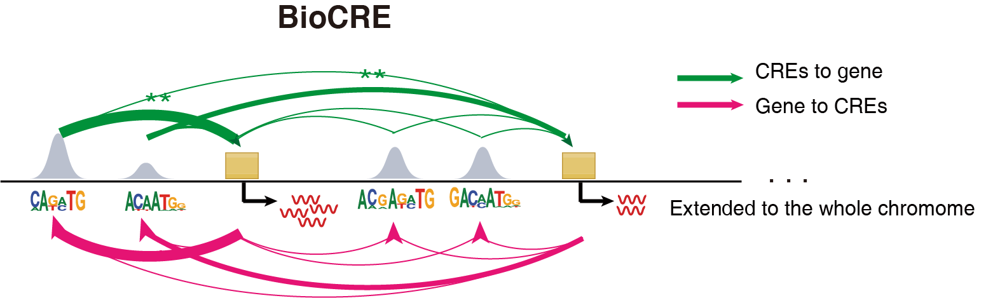

## BioCRE

BioCRE, an innovative computational framework, employs a sophisticated bi-orientation regression model to analyze multi-omics datasets. This approach deciphers the complex interactions within Gene Regulatory Networks (GRNs) at the chromosomal scale, pinpointing crucial Cis-Regulatory Elements (CREs) that play pivotal roles in gene expression and regulation. By integrating diverse genomic information, BioCRE enhances our understanding of cellular processes and disease mechanisms, offering new avenues for therapeutic intervention and personalized medicine strategies.

## Installation
Installation with virtual environment are suggested:
```
conda create -n biocre python=3.8
```
To install BioCRE, make sure you have [PyTorch](https://pytorch.org/) installed.
```
pip install torch torchvision torchaudio -i https://mirrors.cloud.tencent.com/pypi/simple
```
Then install BioCRE by pip:
```
pip install biocre
```

## Usage of BioCRE
Executing the BioCRE pipeline necessitates the provision of three primary inputs: `rna_adata`, `atac_adata`, and `meta_data`:
* `rna_adata` - This represents the snRNA-seq data encapsulated in an AnnData object. 
* `atac_adata` - This represents the snATAC-seq data encapsulated in an AnnData object.  
* `meta_data` - This data serves as a genomic annotation of genes and peaks. Typically, the cellranger output file named 'features.tsv.gz' serves as the metadata.

To ensure accurate integration and comparison across multi-omics data, it is imperative that the cells represented in both AnnData objects (rna_adata and atac_adata) are identical. This means that each cell in one dataset should correspond directly to a cell in the other dataset, maintaining consistency in cell identity and order.Pre-processing steps should be applied to the cells prior to inputting them into the analysis pipeline. These pre-processing measures typically include quality control checks, normalization, filtering out low-quality cells or features, and batch effect correction, if necessary. By performing these steps, you enhance the reliability and interpretability of downstream multi-omics analyses, ensuring that any observed correlations or differences are biologically meaningful rather than artifacts of technical variability.

After preparing the input data, you can run BioCRE using following code:
```
result = linkage(rna_adata,
                 atac_adata,
                 meta_data, ,
                 min_cell=10,
                 lr=0.5,
                 max_iter=500,
                 lambda_l2=0.1,
                 downsample=None)
```
The returned list encompasses the linkage for each chromosome. Given that BioCRE can be resource-intensive, employing significant amounts of memory, you may opt to expedite processing and reduce memory consumption through cell downsampling. Setting the desired cell count via the `downsample` parameter facilitates this. Alternatively, utilizing the metacells derived from rna_adata and atac_adata can also speed computations, offering a strategy to manage large datasets more efficiently.

## Example
tutorial_pbmc.ipynb


